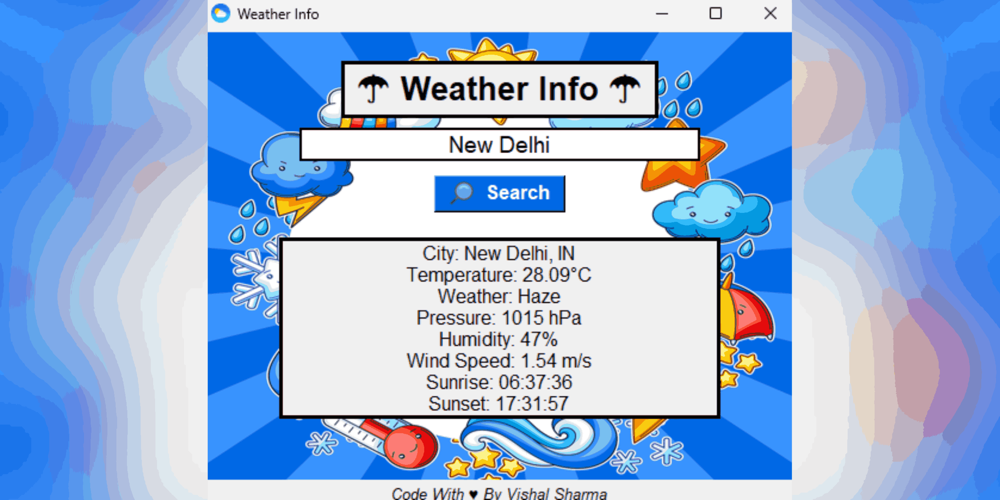

# Python Weather Info App ☁️

A simple and customizable weather application built with Python, utilizing Tkinter for the GUI and the OpenWeatherMap API to fetch real-time weather data. This app provides accurate and up-to-date weather information for any city you choose, with a sleek, user-friendly interface.

  

## Features

- **Real-Time Weather Information**: Displays temperature, pressure, humidity, wind speed, sunrise, and sunset details.
- **City Search**: Easily search for weather information by entering any city name.
- **Customizable UI**: Modify the app’s appearance such as text, colors, and background images via `config.py`.
- **Default City Setting**: The app loads the weather info for a default city at startup, which can be changed by the user.
- **Responsive Layout**: The app adjusts to different screen sizes and resolutions.
- **Background Image Customization**: Change the background image to personalize the look of the app.
- **Cross-Platform Support**: Works on multiple platforms (Windows, MacOS, Linux) without needing additional dependencies.

## Installation
 
### Step 1: Clone the repository

Start by cloning the repository to your local machine:

```bash
git clone https://github.com/livebcdev0603/Python-Weather-Info-App.git
```

### Step 2: Install the required dependencies

Navigate to the project directory and install the required Python libraries:

```bash
cd Python-Weather-Info-App
pip install -r requirements.txt
```

### Step 3: Configure the OpenWeatherMap API

To fetch weather data, you'll need to register for an API key from [OpenWeatherMap](https://home.openweathermap.org/api_keys). Once you have your API key, update the `config.py` file with your key.

### Step 4: Run the app

After configuring the API key, run the app using:

```bash
python weather_app.py
```

### Step 5: Enjoy!

Now you can enter any city name and get its weather information instantly.

## Configuration

All configurable settings are located in the `config.py` file. Below is a detailed description of each option and how to modify them.

### config.py

```py
# API Configuration
API_KEY = "Your_OpenWeatherMap_API_Key"  # Your OpenWeatherMap API Key
BASE_URL = "http://api.openweathermap.org/data/2.5/weather?"  # Base URL for OpenWeather API

# Customizable text and color settings for the header
HEADER_TOP_TEXT_SIZE = 20  # Font size for the header text
HEADER_TOP_TEXT_COLOR = "#000000"  # Color of the header text
HEADER_TEXT_TOP_BORDER_THICKNESS = 2.5  # Thickness of the header border

# Customizable search bar settings
SEARCH_BAR_BORDER_COLOR = "#FFFFFF"  # Border color for the search bar
SEARCH_BUTTON_COLOR = "#0068E5"  # Background color for the search button
SEARCH_BUTTON_TEXT_COLOR = "#FFFFFF"  # Text color for the search button

# Customizable image settings
DEFAULT_BACKGROUND_IMAGE = "assets/background.png"  # Path to the default background image
SEARCH_ICON_IMAGE = "assets/search_icon.png"  # Path to the search button icon

# Customizable text settings for the weather info box
INFO_TEXT_COLOR = "#000000"  # Text color for the weather info box
INFO_BORDER_THICKNESS = 3  # Thickness of the border for the weather info box

# Default city setting
DEFAULT_CITY = "Toyko"  # Default city to show when the app starts (can be changed by user)
```

### How to Customize

- **API Key**: Replace `"Your_OpenWeatherMap_API_Key"` with your actual OpenWeatherMap API key.
- **Background Image**: Specify your preferred image path for the `DEFAULT_BACKGROUND_IMAGE` and `SEARCH_ICON_IMAGE`.
- **UI Colors**: Adjust the header, button, and text colors by modifying `HEADER_TOP_TEXT_COLOR`, `SEARCH_BUTTON_COLOR`, and other related settings.
- **Default City**: Change the default city that loads on app startup by modifying `DEFAULT_CITY`.

## How to Use

- **Run the Application**: Launch the app by running `python weather_app.py` in your terminal.
- **Search for a City**: Type the name of any city into the search bar and click the "Search" button to get the weather information for that city.
- **View the Results**: The app will display detailed weather information such as temperature, pressure, humidity, wind speed, sunrise, and sunset for the entered city.

## Additional Functionalities

- The app uses threading to fetch weather data without freezing the user interface.
- The search input automatically clears after each search, and it supports pressing the Enter key to search.
- The background image and other customizable elements can be modified in real time.

## Support

If you find this app useful and would like to support me and this project:

## Contributing

We welcome contributions to make the app even better! If you have ideas for new features, improvements, or bug fixes, feel free to get involved by following these steps:
1. Start this repository
2. Fork the repository.
3. Create a new branch (`git checkout -b feature-branch`).
4. Make your changes and commit them (`git commit -am 'Added a new feature'`).
5. Push your changes to your fork (`git push origin feature-branch`).
6. Open a pull request with a description of your changes.

By contributing, you help make the app more useful and enjoyable for everyone!

## Issues

If you encounter any bugs or have suggestions for improvements, please open an issue in the Issues tab of the repository. We'll be happy to address them!

## Acknowledgments

- Thanks to [OpenWeatherMap](https://home.openweathermap.org/api_keys) for providing the weather API that powers this app.
- Thanks to all contributors who improve this project and make it better!